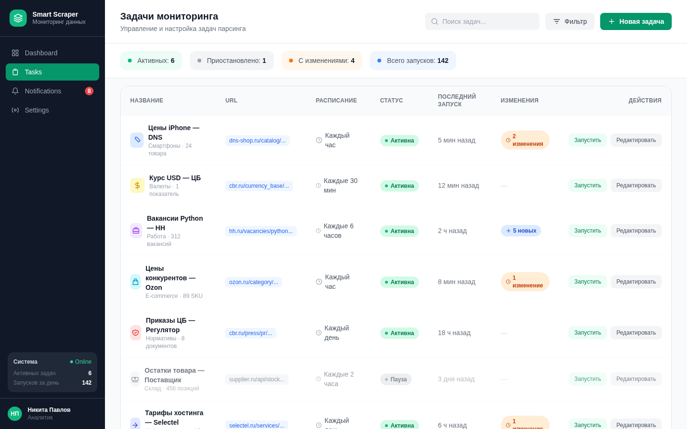

<!--
  BANNER: см. github_resume/DESIGN_SYSTEM.md — Smart Scraper Platform
  Сохранить как assets/banner.png и раскомментировать:
-->
<!--  -->

> **[English version](README_EN.md)**

<div align="center">

# Smart Scraper Platform

### SaaS-платформа мониторинга сайтов с AI-аналитикой

[](https://github.com/AndrewSheff/smart-scraper-platform/actions)
[](https://python.org)
[](https://fastapi.tiangolo.com)
[](https://react.dev)
[](https://typescriptlang.org)
[](https://postgresql.org)
[](https://docker.com)
[](LICENSE)

**Мониторьте любой сайт по расписанию. Автоматическое обнаружение изменений. AI-саммари и Telegram-уведомления.**

[Быстрый старт](#быстрый-старт) · [Возможности](#возможности) · [Скриншоты](#скриншоты) · [Архитектура](#архитектура) · [API](#api-документация)

</div>

---

> **Проблема:** Маркетологи проверяют цены конкурентов вручную каждое утро — 10 сайтов x 30 минут. Юристы пропускают обновления регуляторов и получают штрафы. Закупщики мониторят каталоги поставщиков руками. Существующие решения или слишком сложные (Scrapy), или дорогие ($100+/мес).

**Smart Scraper Platform** — self-hosted SaaS для автоматизированного мониторинга сайтов. Настройте CSS/XPath-селекторы через визуальный интерфейс, задайте расписание и получайте Telegram-уведомления с AI-саммари при изменении данных.

<div align="center">

| Строк кода | API Endpoints | Модели БД | Страниц | Тестов | Docker-сервисов |
|:---:|:---:|:---:|:---:|:---:|:---:|
| **10 400+** | **31** | **6** | **13** | **48+** | **5** |

</div>

---

## Скриншоты

| Задачи мониторинга |
|:------------------:|
|  |

---

## Возможности

**Визуальный конструктор задач** — введите URL, добавьте CSS или XPath-селекторы и нажмите Preview, чтобы сразу увидеть извлеченные значения. Без написания кода.

**Cron-расписание** — запускайте задачи от каждых 5 минут до раза в месяц. Понятное отображение расписания. Ручной запуск "Запустить сейчас" для моментальной проверки.

**Движок обнаружения изменений** — diff-сравнение между запусками. Видите точно, что изменилось (старое значение vs новое значение) с подсвеченными различиями.

**AI-саммари** — Claude или GPT анализирует изменения и объясняет, что произошло и почему это важно. Настраиваемые AI-промпты для каждой задачи под конкретную предметную область.

**Telegram-уведомления** — мгновенные оповещения при обнаружении изменений. Настраиваются для каждой задачи. Включают саммари изменений и AI-анализ.

**Извлечение нескольких полей** — извлекайте несколько точек данных с одной страницы (цена, заголовок, наличие на складе и т.д.). У каждого поля свой селектор и метка.

**История запусков** — полный лог каждого выполнения задачи с временными метками, извлеченными данными и индикаторами изменений. Отслеживайте тренды во времени.

**Экспорт в Excel** — скачивайте извлеченные данные и историю изменений в XLSX для отчетности и анализа.

**Ролевой доступ** — роли Admin и User. Пользователи управляют своими задачами; администраторы видят все.

**Enterprise-безопасность** — JWT + bcrypt, rate limiting, CORS, структурированное логирование, трассировка запросов.

---

## Архитектура

```
┌──────────────────────────────────────────────────┐
│                   Nginx :80                       │
│         Обратный прокси + заголовки безопасности  │
├──────────────────┬───────────────────────────────┤
│  Frontend :3000  │        Backend :8000           │
│  React 19 + Vite │     FastAPI + Uvicorn          │
│  TailwindCSS v4  │     SQLAlchemy 2.0 (async)     │
│  13 страниц      │   ┌────────────────────────┐   │
│                  │   │  Пайплайн скрапинга     │   │
│                  │   │  httpx → BS4 → Diff     │   │
│                  │   │  → AI-саммари → Алерт   │   │
│                  │   └────────────────────────┘   │
├──────────────────┴───────────────────────────────┤
│   PostgreSQL 16              Redis 7              │
│   6 моделей, Alembic         Rate Limiting        │
│   История запусков           Кэш сессий           │
│                                                    │
│              APScheduler (cron-задачи)             │
└──────────────────────────────────────────────────┘
```

### Пайплайн скрапинга

```
Cron-триггер (или ручной "Запустить сейчас")
        |
        v
  [httpx GET целевого URL]
        |
        v
  [BeautifulSoup парсит HTML]
        |
        v
  [Извлечение значений по CSS/XPath-селекторам]
        |
        v
  [Сравнение с предыдущим запуском (diff-движок)]
        |
        +---> Нет изменений --> Сохранить результат, готово
        |
        +---> Изменения обнаружены:
                |
                v
          [AI-саммари (Claude/GPT)]
                |
                v
          [Telegram-уведомление]
                |
                v
          [Сохранить результат + diff]
```

---

## Быстрый старт

### Требования
- Docker и Docker Compose v2+
- (Опционально) Токен Telegram-бота для уведомлений
- (Опционально) API-ключ Anthropic или OpenAI для AI-саммари

### 1. Клонировать и настроить

```bash
git clone https://github.com/AndrewSheff/smart-scraper-platform.git
cd smart-scraper-platform
cp .env.example .env
```

Отредактируйте `.env`:

```env
SECRET_KEY=your-random-32-char-string    # обязательно
ADMIN_PASSWORD=SecurePass123             # обязательно
TELEGRAM_BOT_TOKEN=123456:ABC-DEF...    # опционально
TELEGRAM_CHAT_ID=your_chat_id           # опционально
ANTHROPIC_API_KEY=sk-ant-...             # опционально
```

### 2. Запуск

```bash
docker compose up -d
```

### 3. Доступ

| Сервис | URL |
|:-------|:----|
| Приложение | http://localhost |
| API Docs (Swagger) | http://localhost/docs |

Войдите с учетными данными администратора и создайте первую задачу скрапинга.

---

## Технологии

| Слой | Технология | Версия |
|:-----|:-----------|:-------|
| **Backend** | Python, FastAPI, SQLAlchemy (async), Alembic | 3.13, 0.115, 2.0 |
| **Скрапинг** | httpx, BeautifulSoup4, lxml | Async HTTP |
| **Планировщик** | APScheduler | Cron-выражения |
| **Frontend** | React, TypeScript, Vite, TailwindCSS, shadcn/ui | 19, 5+, 6, v4 |
| **База данных** | PostgreSQL | 16 |
| **Кэш** | Redis | 7 |
| **AI** | Anthropic Claude, OpenAI GPT | Latest |
| **Уведомления** | Telegram Bot API (aiogram) | Мгновенные алерты |
| **Авторизация** | JWT + bcrypt | HS256 |
| **Инфраструктура** | Docker Compose, Nginx, GitHub Actions CI/CD | Multi-stage |

---

## API документация

Интерактивный Swagger по адресу `/docs`. **31 endpoint** в 8 группах:

| Группа | Префикс | Endpoints |
|:-------|:--------|:----------|
| Auth | `/api/v1/auth` | Регистрация, вход, обновление токена |
| Tasks | `/api/v1/tasks` | CRUD, запуск, пауза/возобновление |
| Runs | `/api/v1/runs` | История запусков, результаты, diff |
| Fields | `/api/v1/fields` | Управление селекторами задачи |
| Notifications | `/api/v1/notifications` | Настройка Telegram, тестовое сообщение |
| Dashboard | `/api/v1/dashboard` | Статистика и графики активности |
| Users | `/api/v1/users` | Управление пользователями |
| Health | `/api/v1/health` | Проверка работоспособности |

---

## Структура проекта

```
smart-scraper-platform/
├── backend/
│   ├── app/
│   │   ├── main.py              # FastAPI-приложение с lifespan
│   │   ├── config.py            # Настройки Pydantic
│   │   ├── database.py          # Async SQLAlchemy engine
│   │   ├── api/v1/              # 8 REST API роутеров
│   │   ├── models/              # 6 SQLAlchemy-моделей
│   │   ├── schemas/             # Pydantic v2 схемы
│   │   ├── services/            # Скрапинг, diff, AI, уведомления
│   │   ├── workers/             # APScheduler task runner
│   │   └── core/                # Безопасность, логирование, исключения
│   ├── tests/                   # 48+ pytest-тестов
│   ├── alembic/                 # Миграции базы данных
│   └── Dockerfile
├── frontend/
│   ├── src/
│   │   ├── api/                 # Axios API-клиенты
│   │   ├── components/          # UI-компоненты + layout
│   │   ├── contexts/            # Auth context
│   │   ├── pages/               # 13 компонентов страниц
│   │   └── lib/                 # Утилиты
│   └── Dockerfile
├── docker/nginx/
├── .github/workflows/           # CI/CD
├── docker-compose.yml           # 5 сервисов
└── .env.example
```

---

## Переменные окружения

| Переменная | Обязательна | По умолчанию | Описание |
|:-----------|:------------|:-------------|:---------|
| `SECRET_KEY` | Да | -- | Ключ подписи JWT |
| `ADMIN_PASSWORD` | Да | -- | Начальный пароль администратора |
| `DATABASE_URL` | Нет | Авто | Подключение к PostgreSQL |
| `REDIS_URL` | Нет | Авто | Подключение к Redis |
| `TELEGRAM_BOT_TOKEN` | Нет | -- | Для Telegram-уведомлений |
| `TELEGRAM_CHAT_ID` | Нет | -- | Получатель Telegram-уведомлений |
| `ANTHROPIC_API_KEY` | Нет | -- | Для AI-саммари Claude |
| `OPENAI_API_KEY` | Нет | -- | Для AI-саммари GPT |
| `LOG_LEVEL` | Нет | `INFO` | Уровень логирования |

---

## Разработка

```bash
# Backend
cd backend
python -m venv .venv && source .venv/bin/activate
pip install -r requirements.txt
docker compose up -d postgres redis
alembic upgrade head
uvicorn app.main:app --reload --port 8000

# Frontend
cd frontend && npm install && npm run dev

# Тесты
cd backend && pytest tests/ -v

# Линтинг
ruff check backend/
cd frontend && npm run lint && npx tsc --noEmit
```

---

## Лицензия

[MIT](LICENSE) — свободное использование в коммерческих проектах.
